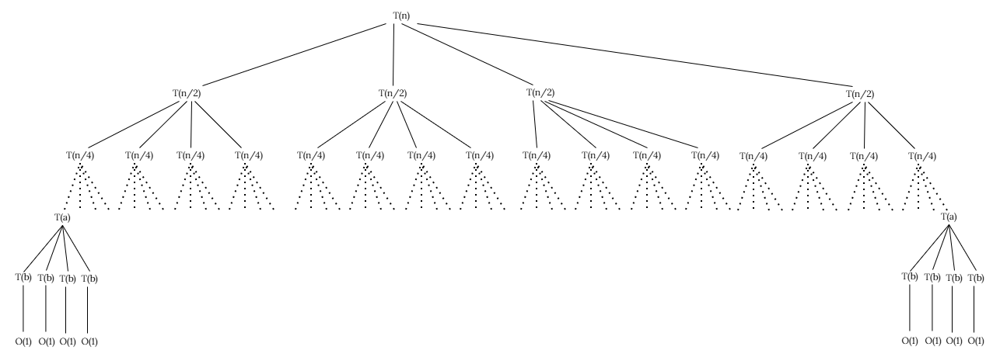
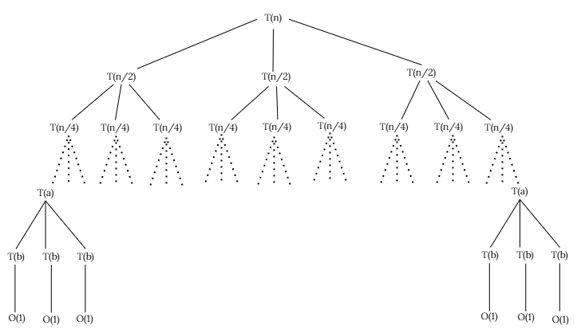

# Algoritmo de Karatsuba

## As Limitações do Método Tradicional

Até agora, tratamos qualquer operação aritmética — soma, subtração, multiplicação — como tendo custo $O(1)$. Isso faz sentido para números que cabem em um registrador de 32 ou 64 bits. Mas e quando precisamos multiplicar números com **milhares ou milhões de dígitos**, como em criptografia ou simulações científicas?

Nesses casos, o computador opera **dígito por dígito**. Por isso, precisamos redefinir a operação básica.

!!! Aviso
A partir de agora, a **operação básica** é a manipulação de um único dígito. Isso muda tudo na nossa análise de complexidade.
!!!

Consequências imediatas:

- **Somar** dois números de $n$ dígitos: custo $O(n)$.
- **Multiplicar** pelo método escolar: custo $O(n^2)$.

Nosso objetivo: encontrar um algoritmo melhor do que $O(n^2)$.

## Dividir para Conquistar

A ideia é simples: se o número é grande demais, quebre-o ao meio e resolva partes menores. Dado dois números $x$ e $y$ de $n$ dígitos, podemos separá-los em uma metade alta e uma metade baixa, cada uma com $n/2$ dígitos.

??? Checkpoint

Considere o número $x = 1234$. Como você escreveria $x$ como uma soma envolvendo suas metades $12$ e $34$ e uma potência de $10$?

::: Gabarito
$$1234 = 12 \cdot 10^{2} + 34$$

De forma geral, para qualquer número $x$ de $n$ dígitos:

$$x = A_1 \cdot 10^{n/2} + A_0$$

onde $A_1 = 12$ é a metade alta (dígitos mais significativos) e $A_0 = 34$ é a metade baixa (dígitos menos significativos).
:::

???

Aplicando a mesma ideia para $y$, temos:

$$x = A_1 \cdot 10^{n/2} + A_0 \qquad y = B_1 \cdot 10^{n/2} + B_0$$

??? Checkpoint

Usando as representações acima, expanda o produto $x \cdot y$ aplicando a propriedade distributiva. O que você obtém?

::: Gabarito
$$x \cdot y = (A_1 \cdot 10^{n/2} + A_0) \cdot (B_1 \cdot 10^{n/2} + B_0)$$

$$x \cdot y = A_1 B_1 \cdot 10^{n} + (A_1 B_0 + A_0 B_1) \cdot 10^{n/2} + A_0 B_0$$
:::

???

??? Checkpoint

Olhe para o resultado da expansão acima. Multiplicar por $10^{n/2}$ ou $10^n$ é equivalente a deslocar dígitos — um simples *shift* —, o que custa apenas $O(n)$. As somas também custam $O(n)$.

Sendo assim, quais são as operações que realmente dominam o custo? Quantas são e de que tamanho são os números envolvidos?

::: Gabarito
O custo real está nas **multiplicações entre os blocos**: $A_1 B_1$, $A_1 B_0$, $A_0 B_1$ e $A_0 B_0$ — são **4 multiplicações**, cada uma entre números de $n/2$ dígitos.

Os *shifts* e as somas custam apenas $O(n)$ e não dominam o custo total.
:::

???

## Por Que a Divisão Simples Não Basta

Vimos que, ao dividir os números ao meio, geramos **4 multiplicações** de subproblemas de tamanho $n/2$ e um custo adicional de $O(n)$ para as somas e os *shifts*. A relação de recorrência desse método é:

$$T(n) = 4T(n/2) + O(n)$$

Será que essa estratégia de "dividir para conquistar" já é suficiente para vencer o método escolar? Vamos analisar a **árvore de recursão** desse método ingênuo para entender o que está acontecendo.



??? Checkpoint
No **Nível 0**, temos apenas 1 problema de tamanho $n$. Qual é o custo extra (trabalho de somar e deslocar) desse nível?
::: Gabarito
$$c \cdot n$$
O custo é proporcional a $n$ porque as operações realizadas (somas, subtrações e deslocamentos) percorrem todos os dígitos dos números.

Multiplicamos por uma constante $c$ porque estamos realizando **um número fixo de operações** desse tipo, independentemente de $n$.
:::
???

??? Checkpoint
No **Nível 1**, existem 4 problemas de tamanho $n/2$. Qual é o custo total deste nível?
::: Gabarito
$$4 \cdot c \cdot \frac{n}{2} = 2cn$$
:::
???

??? Checkpoint
No **Nível 2**, existem $4^2 = 16$ problemas de tamanho $n/4$. Qual é o custo total?
::: Gabarito
$$16 \cdot c \cdot \frac{n}{4} = 4cn$$
:::
???

??? Checkpoint
Consegue perceber o padrão? Escreva a fórmula do custo total no **Nível $i$**.
::: Gabarito
O custo **dobra** a cada nível da árvore:
$$c \cdot n \cdot 2^i$$
:::
???

??? Checkpoint
A recursão para quando o tamanho do problema chega a **1**. Se o tamanho do subproblema após $k$ níveis é $n/2^k$, para qual valor de $k$ o subproblema tem tamanho 1? Esse é a **altura** da árvore.
::: Gabarito
$$\frac{n}{2^k} = 1 \implies n = 2^k \implies k = \log_2 n$$
:::
???

??? Checkpoint
Monte a soma dos custos de todos os níveis (do nível 0 até o nível $\log_2 n$) e simplifique. *(Dica: é uma PG. Lembre que $2^{\log_2 n} = n$.)*
::: Gabarito
$$S = cn + 2cn + 4cn + \dots + cn \cdot 2^{\log_2 n} = cn \cdot [1 + 2 + 4 + \dots + 2^{\log_2 n}]$$

Usando a fórmula da PG com $a_1 = 1$, $q = 2$ e $x = \log_2 n + 1$:

$$S = cn \cdot \frac{2^{\log_2 n + 1} - 1}{2 - 1} = cn \cdot (2n - 1) = 2cn^2 - cn$$
:::
???

{red}(Nadamos, nadamos... e morremos na praia.) Como o termo de maior ordem é $n^2$, a complexidade é $O(n^2)$ — idêntica à multiplicação dígito a dígito. Dividir ao meio e gerar 4 subproblemas **não melhorou nada**.

Será que existe alguma forma matemática de reduzir esse número de ramificações?

## O Problema Central

Observe novamente a expressão que precisamos computar:

$$x \cdot y = A_1B_1 \cdot 10^{n} + (A_1B_0 + A_0B_1) \cdot 10^{n/2} + A_0B_0$$

Os termos que realmente exigem multiplicação são $A_1B_1$, $A_1B_0$, $A_0B_1$ e $A_0B_0$.

??? Checkpoint

Olhe com atenção para a expressão acima. Os termos cruzados $A_1B_0$ e $A_0B_1$ aparecem separados ou sempre juntos na fórmula? O que isso sugere?

::: Gabarito
Eles aparecem **sempre somados**: $(A_1B_0 + A_0B_1)$. A fórmula nunca precisa de $A_1B_0$ ou $A_0B_1$ individualmente — só da soma dos dois.

Isso sugere que, se conseguirmos calcular essa **soma diretamente**, sem precisar de cada multiplicação separada, economizamos uma multiplicação inteira.
:::

???

## A Ideia de Karatsuba

Então o problema se resume a: **como obter $A_1B_0 + A_0B_1$ com menos do que 2 multiplicações?**

??? Checkpoint

Tente expandir o produto $(A_1 + A_0) \cdot (B_1 + B_0)$ usando a propriedade distributiva. Quais termos aparecem na expansão?

::: Gabarito
$$( A_1 + A_0) \cdot (B_1 + B_0) = A_1B_1 + A_1B_0 + A_0B_1 + A_0B_0$$
:::

???

??? Checkpoint

Compare a expansão acima com os produtos que já sabemos calcular: $A_1B_1$ e $A_0B_0$. O que sobra se subtrairmos esses dois da expansão?

::: Gabarito
$$(A_1 + A_0)(B_1 + B_0) - A_1B_1 - A_0B_0 = A_1B_0 + A_0B_1$$

Ou seja, a soma dos termos cruzados que precisamos é exatamente o que sobra!
:::

???

??? Checkpoint

Com base nisso, que tipo de operação estamos "trocando"? Por que essa troca é vantajosa?

::: Gabarito
Estamos trocando **duas multiplicações** ($A_1B_0$ e $A_0B_1$) por:

- **Uma multiplicação** extra: $(A_1 + A_0)(B_1 + B_0)$
- **Duas somas** para montar as entradas: $A_1 + A_0$ e $B_1 + B_0$
- **Duas subtrações** para isolar o resultado: $(\ldots) - A_1B_1 - A_0B_0$

Como somas e subtrações custam $O(n)$ e multiplicações custam muito mais, essa troca é extremamente vantajosa.
:::

???

## Estrutura do Algoritmo

Nomeando os três produtos que precisamos calcular:

- $Z_1 = A_1 \cdot B_1$ (produto das partes altas)
- $Z_2 = A_0 \cdot B_0$ (produto das partes baixas)
- $Z_3 = (A_1 + A_0) \cdot (B_1 + B_0)$ (produto das somas)

??? Checkpoint

Com $Z_1$, $Z_2$ e $Z_3$ em mãos, como você escreveria a fórmula final de $x \cdot y$ usando apenas esses três termos, *shifts* e operações aritméticas baratas?

::: Gabarito
Sabemos que $A_1B_0 + A_0B_1 = Z_3 - Z_1 - Z_2$. Substituindo na expansão original:

$$x \cdot y = Z_1 \cdot 10^{n} + (Z_3 - Z_1 - Z_2) \cdot 10^{n/2} + Z_2$$

São apenas **3 multiplicações** recursivas, em vez de 4!
:::

???

Agora que entendemos a ideia matemática, vamos ver como isso aparece em formato de algoritmo.

``` c
long karatsuba(long x, long y) {
    if (x < 10 || y < 10) {
        return x * y;
    }

    int n = max(num_digitos(x), num_digitos(y));

    if (n % 2 != 0) {
        n++;
    }

    int m = n / 2;
    long potencia = potencia10(m);

    long a1 = x / potencia;
    long a0 = x % potencia;
    long b1 = y / potencia;
    long b0 = y % potencia;

    long z1 = karatsuba(a1, b1);
    long z2 = karatsuba(a0, b0);
    long z3 = karatsuba(a1 + a0, b1 + b0);

    long meio = z3 - z1 - z2;

    return z1 * potencia10(n) + meio * potencia + z2;
}
```

!!! Aviso
O código acima utiliza a base 10 para facilitar o entendimento didático. Na prática, o Karatsuba é implementado em **base 2 (binário)**, substituindo divisões e multiplicações por **deslocamentos de bits** `txt (>> e <<)` e **máscaras bit a bit** `txt (&)`, que custam apenas 1 ciclo de *clock*.
!!!

## Por Que Isso é Revolucionário?

| Abordagem | Multiplicações por nível | Complexidade final |
|-----------|:------------------------:|:------------------:|
| Método escolar | 1 (mas dígito a dígito) | $O(n^2)$ |
| Divisão ingênua | 4 | $O(n^2)$ |
| **Karatsuba** | **3** | $\mathbf{O(n^{1.585})}$ |

Reduzir de 4 para 3 multiplicações pode parecer pouco, mas o impacto na árvore de recursão é enorme: cada nível tem **3 vezes mais problemas** que o anterior, mas os problemas têm **metade do tamanho**. O número total de operações cresce como $n^{\log_2 3} \approx n^{1.585}$.

Para $n = 1.000.000$ dígitos, isso é **centenas de vezes mais rápido** que $O(n^2)$!

## Exemplo Passo a Passo

Vamos aplicar Karatsuba a um exemplo concreto para fixar o entendimento.

**Problema:** Multiplicar $A = 12$ e $B = 34$ (base 10, $n=2$)

**Etapa 1: Dividir os números**

- $A = 12 \rightarrow A_1 = 1$, $A_0 = 2$
- $B = 34 \rightarrow B_1 = 3$, $B_0 = 4$

**Etapa 2: Calcular os três produtos**

- $Z_1 = A_1 \cdot B_1 = 1 \cdot 3 = 3$
- $Z_2 = A_0 \cdot B_0 = 2 \cdot 4 = 8$
- $Z_3 = (A_1 + A_0) \cdot (B_1 + B_0) = (1+2) \cdot (3+4) = 3 \cdot 7 = 21$

??? Checkpoint
Por que $Z_3$ usa as somas $A_1+A_0$ e $B_1+B_0$? O que isso representa?
::: Gabarito
$Z_3$ é o produto auxiliar que nos dará os termos cruzados. Quando expandimos:

$$(A_1+A_0)(B_1+B_0) = A_1B_1 + A_1B_0 + A_0B_1 + A_0B_0 = Z_1 + (A_1B_0 + A_0B_1) + Z_2$$

É como se $Z_3$ contivesse "tudo de uma vez" — daí podemos isolar a soma que precisamos subtraindo $Z_1$ e $Z_2$.
:::
???

**Etapa 3: Calcular o termo do meio**

$$Z_3 - Z_1 - Z_2 = 21 - 3 - 8 = 10$$

Isto é exatamente $(A_1B_0 + A_0B_1)$!

**Etapa 4: Montar o resultado final**

Com $10^{n} = 10^2 = 100$ e $10^{n/2} = 10^1 = 10$:

$$x \cdot y = Z_1 \cdot 100 + (Z_3 - Z_1 - Z_2) \cdot 10 + Z_2 = 3 \cdot 100 + 10 \cdot 10 + 8 = 408$$

Conferindo: $12 \times 34 = 408$ ✓

??? Checkpoint
Neste exemplo, usamos multiplicações diretas porque $n=2$ (caso base). Em um caso maior, como $n=8$, o que aconteceria?
::: Gabarito
Para $n=8$, cada $Z_1$, $Z_2$ e $Z_3$ seria calculado **recursivamente** usando o mesmo algoritmo — subproblemas de 4 dígitos, que por sua vez gerariam subproblemas de 2 dígitos, e assim por diante até chegar em 1 dígito.
:::
???

## A Recursão

Agora que entendemos como o algoritmo reduz o número de multiplicações para 3, precisamos analisar como isso impacta o tempo de execução.

!!! Aviso
A base de todo processo recursivo é saber a hora de parar. Quando um número tem apenas **1 dígito**, a multiplicação tem custo $O(1)$. Essa é a condição de parada do algoritmo.
!!!

Antes de montar a árvore, separamos dois custos distintos em cada nível:

1. **Custo das chamadas recursivas:** as três multiplicações ($T(n/2)$ cada).
2. **Custo do trabalho extra:** somas ($A_1 + A_0$, $B_1 + B_0$), subtrações e *shifts* — tudo $O(n)$.

!!! Aviso
Esse termo $O(n)$ **não representa uma nova chamada recursiva**. É o trabalho feito **dentro de cada nível** (somas, subtrações e deslocamentos).
!!!

## Montando a Recorrência

??? Checkpoint
Com base na estrutura acima, monte a relação de recorrência para o algoritmo de Karatsuba. Escreva a equação $T(n) = \dots$
::: Gabarito
$$T(n) = 3T\left(\frac{n}{2}\right) + O(n)$$

Onde $3$ é o número de chamadas recursivas, $n/2$ é o tamanho de cada subproblema e $O(n)$ é o custo das somas, subtrações e deslocamentos.
:::
???

## Analisando a Complexidade



??? Checkpoint
Observe a árvore acima. Em cada chamada, quantos subproblemas são gerados? E qual é o tamanho de cada um?
::: Gabarito
O algoritmo gera **3 subproblemas**, cada um com tamanho $n/2$.
:::
???

??? Checkpoint
No nível 0 existe apenas 1 problema de tamanho $n$. Qual é o custo extra desse nível?
::: Gabarito
$$c \cdot n$$
:::
???

??? Checkpoint
No nível 1 existem 3 problemas de tamanho $n/2$. Qual é o custo total desse nível?
::: Gabarito
$$3 \cdot c \cdot \frac{n}{2} = c \cdot n \cdot \frac{3}{2}$$
:::
???

??? Checkpoint
No nível 2 existem $3^2 = 9$ problemas de tamanho $n/4$. Qual é o custo total?
::: Gabarito
$$9 \cdot c \cdot \frac{n}{4} = c \cdot n \cdot \left(\frac{3}{2}\right)^2$$
:::
???

??? Checkpoint
Escreva a fórmula do custo total no nível $i$.
::: Gabarito
$$c \cdot n \cdot \left(\frac{3}{2}\right)^i$$
:::
???

## Somando os Níveis da Árvore

A altura da árvore continua sendo $k = \log_2 n$. Vamos montar a soma total $S$:

??? Checkpoint
Monte a soma dos custos dos níveis da árvore.
::: Gabarito
$$S = c \cdot n \left[1 + \frac{3}{2} + \left(\frac{3}{2}\right)^2 + \dots + \left(\frac{3}{2}\right)^{\log_2 n}\right]$$
:::
???

??? Checkpoint
Identifique os termos da PG dentro dos colchetes: primeiro termo $a_1$, razão $q$ e quantidade de termos $x$.
::: Gabarito
- $a_1 = 1$
- $q = \frac{3}{2}$
- $x = \log_2 n + 1$
:::
???

??? Checkpoint
Calcule a soma total $S$ usando a fórmula da PG: $S_n = a_1 \cdot \frac{q^x - 1}{q - 1}$.
::: Gabarito
$$S = c \cdot n \cdot \frac{\left(\frac{3}{2}\right)^{\log_2 n + 1} - 1}{\frac{3}{2} - 1} = 2c \cdot n \left[\frac{3}{2} \cdot \left(\frac{3}{2}\right)^{\log_2 n} - 1\right]$$
:::
???

??? Checkpoint
Simplifique $\left(\frac{3}{2}\right)^{\log_2 n}$. *(Dica: $2^{\log_2 n} = n$ e $3^{\log_2 n} = n^{\log_2 3}$.)*
::: Gabarito
$$\left(\frac{3}{2}\right)^{\log_2 n} = \frac{3^{\log_2 n}}{2^{\log_2 n}} = \frac{n^{\log_2 3}}{n}$$

Substituindo em $S$, o termo principal cresce proporcionalmente a $n^{\log_2 3}$.
:::
???

Portanto, a complexidade do algoritmo de Karatsuba é:

$$T(n) = O(n^{\log_2 3}) \approx O(n^{1.58})$$

## Resumindo

Karatsuba percebeu que:

1. **O problema real** são as 4 multiplicações do método ingênuo.
2. **A solução** é calcular um produto extra $(A_1 + A_0)(B_1 + B_0)$.
3. **A economia** vem de obter $A_1B_0 + A_0B_1$ por diferença, evitando duas multiplicações.

Trocamos **multiplicações caras** por **adições e subtrações baratas** — um trabalho extra de apenas $O(n)$ por nível. O benefício é reduzir o fator de ramificação da árvore de 4 para 3, levando de $O(n^2)$ para $O(n^{1.58})$.